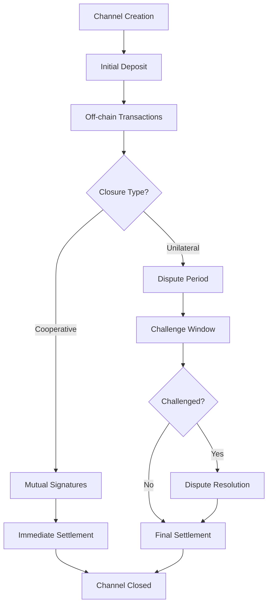

# StacksFlow - Bidirectional Payment Channels

[](https://stacks.co)
[](https://clarity-lang.org)

> A sophisticated Layer 2 scaling solution enabling instant, low-cost STX transactions through bidirectional payment channels on the Stacks blockchain.

## 🚀 Overview

StacksFlow implements state-of-the-art payment channels that allow two parties to conduct unlimited off-chain transactions with minimal on-chain footprint. By leveraging cryptographic commitments and dispute resolution mechanisms, StacksFlow provides a secure, efficient pathway for micropayments and high-frequency transactions.

### Key Features

- **⚡ Instant Transactions**: Execute payments in milliseconds off-chain
- **💰 Cost Efficient**: Drastically reduce transaction fees through batching
- **🔒 Cryptographically Secure**: Multi-signature validation and dispute resolution
- **🤝 Flexible Closure**: Both cooperative and unilateral channel closure options
- **📊 State Management**: Comprehensive nonce-based replay protection
- **🛡️ Emergency Controls**: Built-in safety mechanisms for edge cases

## 🏗️ System Architecture

```
┌─────────────────────────────────────────────────────────────────┐
│                     StacksFlow Architecture                     │
├─────────────────────────┬───────────────────────────────────────┤
│     On-Chain Layer      │           Off-Chain Layer            │
├─────────────────────────┼───────────────────────────────────────┤
│                         │                                       │
│  ┌─────────────────┐   │   ┌─────────────────────────────────┐ │
│  │ Payment Channel │   │   │      Transaction Exchange       │ │
│  │   Smart Contract│◄──┼──►│                                 │ │
│  │                 │   │   │  ┌─────────┐    ┌─────────┐   │ │
│  │ • State Storage │   │   │  │ Party A │◄──►│ Party B │   │ │
│  │ • Fund Escrow   │   │   │  │         │    │         │   │ │
│  │ • Dispute Logic │   │   │  └─────────┘    └─────────┘   │ │
│  │ • Settlement    │   │   │                                 │ │
│  └─────────────────┘   │   └─────────────────────────────────┘ │
│                         │                                       │
└─────────────────────────┴───────────────────────────────────────┘
```

## 🔧 Contract Architecture

### Core Components

#### 1. **Data Layer**

```clarity
payment-channels: Map
├── Key: {channel-id, participant-a, participant-b}
└── Value: {
    ├── total-deposited: uint
    ├── balance-a: uint  
    ├── balance-b: uint
    ├── is-open: bool
    ├── dispute-deadline: uint
    └── nonce: uint
}
```

#### 2. **Function Categories**

| Category | Functions | Purpose |
|----------|-----------|---------|
| **Channel Management** | `create-channel`, `fund-channel` | Initialize and fund payment channels |
| **Cooperative Closure** | `close-channel-cooperative` | Instant mutual closure with signatures |
| **Unilateral Closure** | `initiate-unilateral-close`, `resolve-unilateral-close` | Dispute-based closure mechanism |
| **Read Operations** | `get-channel-info` | Query channel state |
| **Emergency Controls** | `emergency-withdraw` | Owner-only safety mechanism |

#### 3. **Security Mechanisms**

- **Multi-signature Validation**: All state changes require cryptographic proof
- **Nonce Protection**: Sequential numbering prevents replay attacks  
- **Dispute Windows**: Time-locked resolution for unilateral closures
- **Balance Verification**: Mathematical validation of fund conservation
- **Input Sanitization**: Comprehensive parameter validation

## 📊 Data Flow

### Channel Lifecycle



### Transaction Flow

1. **Channel Establishment**
   - Participant A creates channel with initial deposit
   - Channel ID generated from initialization parameters
   - Smart contract locks funds in escrow

2. **Off-chain Operations**
   - Parties exchange signed state updates
   - Each update includes new balance distribution
   - Nonce increments prevent replay attacks

3. **Settlement Paths**
   - **Cooperative**: Both parties sign final state → Instant closure
   - **Unilateral**: One party initiates → Dispute period → Resolution

## 🚀 Quick Start

### Prerequisites

- Stacks Wallet (Hiro Wallet recommended)
- STX tokens for transactions and channel funding
- Basic understanding of Clarity smart contracts

### Deployment

```bash
# Clone the repository
git clone https://github.com/samuel-dafeta/stacks-flow.git

# Deploy to testnet
clarinet deploy --testnet

# Deploy to mainnet  
clarinet deploy --mainnet
```

### Usage Example

```clarity
;; Create a new payment channel
(contract-call? .stacksflow create-channel 
  0x1234567890abcdef1234567890abcdef12345678  ;; channel-id
  'SP2J6ZY48GV1EZ5V2V5RB9MP66SW86PYKKNRV9EJ7  ;; participant-b
  u1000000)                                   ;; 1 STX initial deposit

;; Add more funds to existing channel
(contract-call? .stacksflow fund-channel
  0x1234567890abcdef1234567890abcdef12345678  ;; channel-id
  'SP2J6ZY48GV1EZ5V2V5RB9MP66SW86PYKKNRV9EJ7  ;; participant-b
  u500000)                                    ;; 0.5 STX additional

;; Close channel cooperatively
(contract-call? .stacksflow close-channel-cooperative
  0x1234567890abcdef1234567890abcdef12345678  ;; channel-id
  'SP2J6ZY48GV1EZ5V2V5RB9MP66SW86PYKKNRV9EJ7  ;; participant-b
  u800000                                     ;; final balance A
  u700000                                     ;; final balance B
  0x304502...                                 ;; signature A
  0x304502...)                                ;; signature B
```

## 🔒 Security Considerations

### Audit Status

- [ ] Internal security review
- [ ] External audit pending
- [ ] Formal verification in progress

### Known Limitations

- Simplified signature verification (production requires secp256k1-verify)
- Fixed dispute timeout period
- Binary participant model (no multi-party channels)

### Best Practices

- Always verify signatures before state transitions
- Monitor dispute periods for unilateral closures
- Maintain off-chain backup of channel states
- Use secure random number generation for channel IDs

## 📈 Performance Metrics

| Metric | Value |
|--------|--------|
| **Channel Creation Cost** | ~0.001 STX |
| **Off-chain Transaction Time** | <100ms |
| **Dispute Resolution Period** | ~1 week (1008 blocks) |
| **Maximum Channel Capacity** | Limited by STX supply |
| **Concurrent Channels** | Unlimited |

## 🤝 Contributing

We welcome contributions! Please see our [Contributing Guidelines](CONTRIBUTING.md) for details.

### Development Setup

```bash
# Install Clarinet
npm install -g @hirosystems/clarinet

# Run tests
clarinet test

# Check contract syntax  
clarinet check
```

## 📄 License

This project is licensed under the MIT License - see the [LICENSE](LICENSE) file for details.

## 🔗 Resources

- [Stacks Documentation](https://docs.stacks.co)
- [Clarity Language Reference](https://docs.stacks.co/clarity)
- [Payment Channel Theory](https://en.bitcoin.it/wiki/Payment_channels)
- [Lightning Network Specification](https://github.com/lightningnetwork/lightning-rfc)
